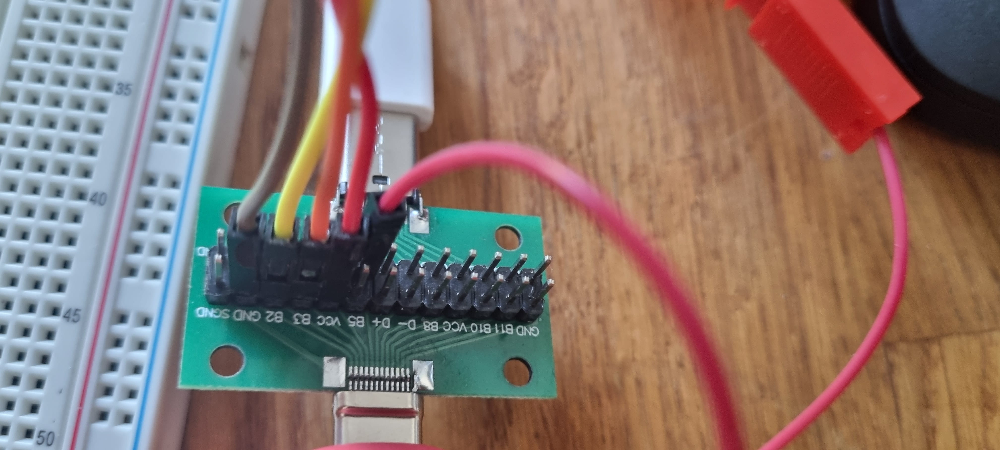

# Hardware development / debugging

## Attach FT2232H as debugger

### Prerequisites

- An FT2232H Breakout Board
- An USB-C Breakout Board
- A 470Ω Resistor
- **OPTIONAL** A Breadboard

### Wiring

Attach wires, according to the [OpenOCD SWD Resistor Hack Schematic](https://github.com/openocd-org/openocd/blob/master/tcl/interface/ftdi/swd-resistor-hack.cfg) and the [Loko Air USB-C Pinout](https://raw.githubusercontent.com/tomipiriyev/Loko/refs/heads/main/Electronics/lokoAir/Loco%20Air.PDF)

- 
- 
- 
- 
- 

### OpenOCD

```
openocd -f openocd-ft2232h.cfg -c init -c 'reset halt'
```
